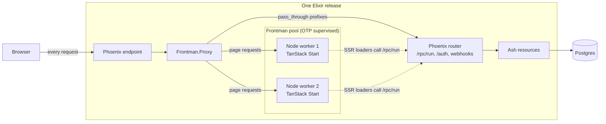

# Frontman

Frontman runs a TanStack Start frontend inside your Elixir release. It starts a pool of Node
SSR servers as supervised OTP children and puts a streaming Plug proxy in front of them, so
Phoenix receives every public request and sends page requests to the least busy Node worker.

It was built for one stack: a Phoenix and Ash backend, a TanStack Start frontend, and the typed
RPC client that AshTypescript generates. The aim is to deploy that pair as a single release,
on one port, with one process tree.

Frontman is experimental. The API may change, and nothing is published to Hex yet.

## What it's for

A TanStack Start app needs a Node server for server-side rendering. The usual setup puts that
server in its own container next to the Phoenix backend, with a reverse proxy splitting traffic
between them. That's two deployables, two health checks, and a network hop that both sides have
to agree on.

Frontman moves the Node servers under Phoenix's supervision tree instead:



With direct Ash RPC loaders and Phoenix-hosted assets, Node handles full page rendering.
The same TanStack route loader runs on Node during SSR and in the browser for client-side
navigation. A `createIsomorphicFn` transport gives each environment its own fetch implementation:
SSR calls Phoenix over loopback with the visitor's cookies; the browser calls same-origin
`/rpc/run` directly. Mutations made through Ash RPC also go straight to Phoenix.

Those RPC calls and assets remain available while the Node pool is unavailable; full page renders
return 503. This is an application integration, not behavior Frontman enforces. Start server
functions still run on Node, so keep them out of this data path. The
[loader setup](docs/setup.md#6-load-data-through-ash-rpc) shows both transports and the route.

Frontman itself has no Phoenix, Ash or TanStack dependency. Any HTTP server that answers the
[readiness handshake](docs/reference.md#worker-protocol) can be a worker, and any Plug pipeline
can host the proxy. [docs/purpose.md](docs/purpose.md) covers the reasoning, and when two
containers is still the better choice.

## What it does

- Starts a fixed number of Node processes through MuonTrap, each on its own loopback port.
- Registers a worker only after it answers `GET /__frontend/ready` with a per-start token.
- Probes each worker while it runs. A worker that stops answering stops getting requests, and
  repeated failures replace it, with exponential backoff and jitter.
- Streams responses back through Phoenix with repeated `Set-Cookie` headers and
  `X-Forwarded-*` headers intact.
- Caps concurrent requests per worker and answers `503` with `Retry-After: 2` when full.
- Drains and resumes the pool for deploys, and emits telemetry and OpenTelemetry spans.
- Packages a release: `mix frontman.package` builds the frontend with a pinned,
  checksum-verified Node and copies Node and the build into `priv`.

It doesn't generate the Ash TypeScript client or configure deployment. Your application owns
those.

## Install

Frontman is a Git dependency for now:

```elixir
{:frontman, github: "wtsnz/frontman", branch: "main"}
```

Run `mix deps.get` and commit `mix.lock`. To pin a commit in `mix.exs` as well, use
`ref: "<commit SHA>"` instead of `branch: "main"`. For local work next to an application, use
`{:frontman, path: "../frontman"}`.

## Quick start

Start a pool after your endpoint, so SSR loaders can reach Phoenix:

```elixir
children = [
  MyAppWeb.Endpoint,
  {Frontman,
   name: MyApp.SSR,
   executable: "/usr/local/bin/node",
   args: [".output/server/index.mjs"],
   directory: "/app/frontend",
   workers: 2,
   env: [{"BACKEND_URL", "http://127.0.0.1:4000"}]}
]
```

Add the proxy to your endpoint, before `Plug.Parsers`, so request bodies reach Node untouched:

```elixir
plug Frontman.Proxy,
  name: MyApp.SSR,
  pass_through: ["/rpc/", "/auth/", "/webhooks/", "/health/"]
```

Paths that start with a `pass_through` prefix continue to your router. Everything else goes to
Node.

Answer the readiness probe in your TanStack Start server entry:

```typescript
import handler, { createServerEntry } from "@tanstack/react-start/server-entry";

export default createServerEntry({
  async fetch(request) {
    if (new URL(request.url).pathname === "/__frontend/ready") {
      return Response.json({ token: process.env.FRONTEND_WORKER_TOKEN, pid: process.pid });
    }
    return handler.fetch(request);
  },
});
```

To ship Node and the build in your release, pin a Node version and run `mix frontman.package`
before `mix release`, for example as your `assets.deploy` alias:

```elixir
# config/config.exs
config :frontman, :package, node_version: "22.22.2"

# mix.exs, in aliases/0
"assets.deploy": ["frontman.package"]
```

It downloads Node for the build machine, verifies it against Node's published SHA-256, runs
`npm ci` and `npm run build` in `frontend/` with it, and copies `node` to `priv/node/bin/node`
and `.output` to `priv/frontend/.output`. Run it where the release is built, on the target
platform.

These snippets assume a Nitro Node server build. [docs/setup.md](docs/setup.md) covers the
Nitro build configuration, the trusted public origin, static assets, both loader transports,
health checks, development and releases.

## Documentation

| Guide | Read it when |
| --- | --- |
| [Purpose](docs/purpose.md) | You're deciding whether this fits your app |
| [Setup](docs/setup.md) | You're adding Frontman to a Phoenix, Ash and TanStack Start app |
| [How it works](docs/architecture.md) | You want the supervision tree, request path and worker lifecycle |
| [Operations](docs/operations.md) | You're deploying, draining, or watching telemetry |
| [Reference](docs/reference.md) | You need an option, function, event or the worker protocol |
| [Measurements](docs/measurements.md) | You want the environment and results behind the CPU comparison |

## Known limits

- The pool size is fixed at boot. There's no autoscaling.
- Request bodies are buffered, up to 8 MB. Responses stream.
- WebSocket upgrades and response trailers are not proxied. Mount sockets in Phoenix.
- Cleanup signals the Node process MuonTrap started, not its descendants. There's no cgroup
  containment, so a killed MuonTrap wrapper can orphan Node on some systems.
- Phoenix sits on the page path. If Phoenix is down, pages are down with it.

[docs/operations.md](docs/operations.md#limits) lists the rest.

## Development

Requires Elixir 1.20+, Erlang, a C compiler for MuonTrap, Node on `PATH`, and POSIX `ps` and
`kill`. These are the CI checks:

```sh
mix deps.get
mix format --check-formatted
mix compile --warnings-as-errors
mix test
mix hex.build
```

The tests run the proxy against a real Bandit upstream and the workers against real Node
processes. To watch admission and drain work end to end:

```sh
MIX_ENV=test mix run examples/admission.exs
```

`mix hex.build` only builds a local tarball. Publishing to Hex is a separate, manual step.
See [CHANGELOG.md](CHANGELOG.md) for changes.

## License

MIT. See [LICENSE](LICENSE).
