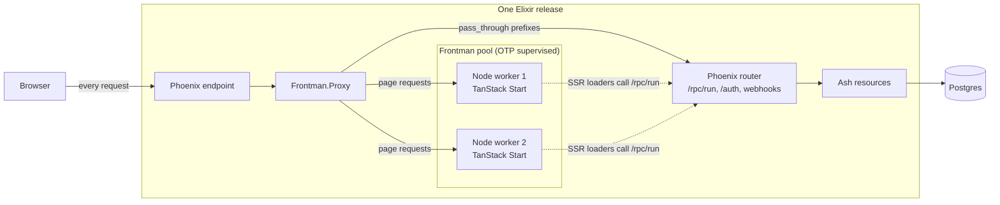

# Frontman

Frontman runs a TanStack Start frontend inside your Elixir release. It starts a pool of Node
SSR servers as supervised OTP children and puts a streaming Plug proxy in front of them, so
Phoenix receives every public request and sends page requests to the least busy Node worker.

It was built for one stack: a Phoenix and Ash backend, a TanStack Start frontend, and the typed
RPC client that AshTypescript generates. The aim is to deploy that pair as a single release,
on one port, with one process tree.

Frontman is experimental. The API may change, and nothing is published to Hex yet.

## What it's for

A TanStack Start app needs a Node server for server-side rendering. The usual setup puts that
server in its own container next to the Phoenix backend, with a reverse proxy splitting traffic
between them. That's two deployables, two health checks, and a network hop that both sides have
to agree on.

Frontman moves the Node servers under Phoenix's supervision tree instead:



With direct Ash RPC loaders and Phoenix-hosted assets, Node handles full page rendering.
The same TanStack route loader runs on Node during SSR and in the browser for client-side
navigation. A `createIsomorphicFn` transport gives each environment its own fetch implementation:
SSR calls Phoenix over loopback with the visitor's cookies; the browser calls same-origin
`/rpc/run` directly. Mutations made through Ash RPC also go straight to Phoenix.

Those RPC calls and assets remain available while the Node pool is unavailable; full page renders
return 503. This is an application integration, not behavior Frontman enforces. Start server
functions still run on Node, so keep them out of this data path. The
[loader setup](docs/setup.md#6-load-data-through-ash-rpc) shows both transports and the route.

Frontman itself has no Phoenix, Ash or TanStack dependency. Any HTTP server that answers the
[readiness handshake](docs/reference.md#worker-protocol) can be a worker, and any Plug pipeline
can host the proxy. [docs/purpose.md](docs/purpose.md) covers the reasoning, and when two
containers is still the better choice.

## What it does

- Starts a fixed number of Node processes through MuonTrap, each on its own loopback port.
- Registers a worker only after it answers `GET /__frontend/ready` with a per-start token.
- Probes each worker while it runs. A worker that stops answering stops getting requests, and
  repeated failures replace it, with exponential backoff and jitter.
- Streams responses back through Phoenix with repeated `Set-Cookie` headers and
  `X-Forwarded-*` headers intact.
- Caps concurrent requests per worker and answers `503` with `Retry-After: 2` when full.
- Drains and resumes the pool for deploys, and emits telemetry and OpenTelemetry spans.
- Optionally caches pages that Node marks as the same for every visitor, in memory on each node,
  rendering each one once under load.
- Packages a release: `mix frontman.package` builds the frontend with a pinned,
  checksum-verified Node and copies Node and the build into `priv`.

It doesn't generate the Ash TypeScript client or configure deployment. Your application owns
those.

## Install

Frontman is a Git dependency for now:

```elixir
{:frontman, github: "wtsnz/frontman", branch: "main"}
```

Run `mix deps.get` and commit `mix.lock`. To pin a commit in `mix.exs` as well, use
`ref: "<commit SHA>"` instead of `branch: "main"`. For local work next to an application, use
`{:frontman, path: "../frontman"}`.

## Quick start

Start a pool after your endpoint, so SSR loaders can reach Phoenix:

```elixir
children = [
  MyAppWeb.Endpoint,
  {Frontman,
   name: MyApp.SSR,
   executable: "/usr/local/bin/node",
   args: [".output/server/index.mjs"],
   directory: "/app/frontend",
   workers: 2,
   env: [{"BACKEND_URL", "http://127.0.0.1:4000"}]}
]
```

Add the proxy to your endpoint, before `Plug.Parsers`, so request bodies reach Node untouched:

```elixir
plug Frontman.Proxy,
  name: MyApp.SSR,
  pass_through: ["/rpc/", "/auth/", "/webhooks/", "/health/"]
```

Paths that start with a `pass_through` prefix continue to your router. Everything else goes to
Node.

Answer the readiness probe in your TanStack Start server entry:

```typescript
import handler, { createServerEntry } from "@tanstack/react-start/server-entry";

export default createServerEntry({
  async fetch(request) {
    if (new URL(request.url).pathname === "/__frontend/ready") {
      return Response.json({ token: process.env.FRONTEND_WORKER_TOKEN, pid: process.pid });
    }
    return handler.fetch(request);
  },
});
```

To ship Node and the build in your release, pin a Node version and run `mix frontman.package`
before `mix release`, for example as your `assets.deploy` alias:

```elixir
# config/config.exs
config :frontman, :package, node_version: "22.22.2"

# mix.exs, in aliases/0
"assets.deploy": ["frontman.package"]
```

It downloads Node for the build machine, verifies it against Node's published SHA-256, runs
`npm ci` and `npm run build` in `frontend/` with it, and copies `node` to `priv/node/bin/node`
and `.output` to `priv/frontend/.output`. Run it where the release is built, on the target
platform.

These snippets assume a Nitro Node server build. [docs/setup.md](docs/setup.md) covers the
Nitro build configuration, the trusted public origin, static assets, both loader transports,
health checks, development and releases.

## Page cache

The cache is off unless you configure it. Turn it on per pool:

```elixir
{Frontman,
 name: MyApp.SSR,
 # ...executable, args, directory, workers
 cache: [
   max_entries: 10_000,
   max_bytes: 64_000_000,
   query: {:except, ["utm_source", "utm_medium", "utm_campaign", "gclid", "fbclid"]}
 ]}
```

Frontman then stores a page only when Node marks the response with an `x-frontman-cache`
header. Everything else is proxied exactly as before. The header never reaches the browser.

### Mark a TanStack Start route

Start merges the `headers` of every matched route into the page response, so a route marks
itself:

```typescript
// frontend/src/lib/cache.ts
// Frontman never caches under the Vite dev server, and this keeps the header out of it too.
export const cacheable =
  (directives = "public") =>
  () =>
    import.meta.env.DEV ? {} : { "x-frontman-cache": directives };
```

```tsx
// frontend/src/routes/pricing.tsx
import { createFileRoute } from "@tanstack/react-router";
import { cacheable } from "../lib/cache";

export const Route = createFileRoute("/pricing")({
  headers: cacheable("public, max-age=300, stale-while-revalidate=3600"),
  loader: () => loadPlans(),
  component: Pricing,
});
```

| Directive | Meaning |
| --- | --- |
| `public` | Required. The HTML is the same for every visitor. |
| `max-age=N` | Fresh for N seconds. After that the next request renders it again. |
| `stale-while-revalidate=N` | For N seconds past `max-age`, serve the old copy while one background render replaces it. Needs `max-age`. |

Without `max-age`, a page stays until you invalidate it, the cache evicts it, or the node
restarts. Each node starts empty, so a deploy always serves fresh pages. A header with any other
directive is ignored and the page isn't stored.

### Keep cached pages the same for everyone

The cache key is the host, path and query string. Frontman never keys or varies on cookies or
other request headers, so every visitor gets the HTML of whichever request rendered the page.
Personalise in the browser instead:

- load the visitor's data after hydration, for example from `/rpc/run`; or
- set a readable hint cookie such as `signed_in=1` at login, copy it onto `<html>` with a
  small inline script, and let CSS show "Account" instead of "Sign in".

Every loader in the matched route tree runs during a cached render, including the root route's.
If the root loader reads the session, the first visitor's account ends up in everyone's page. In
the starter app, marking `/about` cacheable while the root loader still loaded the session cached
the signed-in user's email and served it to an anonymous visitor. Load the session on the
client for cacheable routes, or keep it out of their tree.

To catch this before production, turn on `debug: true` in a staging or local release. Frontman
then renders every marked page that was requested with cookies or an `Authorization` header a
second time without them. It stores the anonymous copy, and logs a warning with the first
difference if the two don't match. In the starter, that warning pointed straight at the root
layout's signed-in navigation. Debug mode also logs why a marked page wasn't stored. It costs
one extra render per stored page, and the log can contain personal data, so leave it off in
production.

The host in the key is the one Node is told: `X-Forwarded-Host` if the request has one,
otherwise `Host`. The scheme comes from `X-Forwarded-Proto`. A request with a forged
`X-Forwarded-Host` can only fill an entry for that forged host.

### Query strings

| `query` | Key |
| --- | --- |
| `:all` (default) | Every parameter. Order doesn't matter: `?b=2&a=1` and `?a=1&b=2` share an entry. |
| `{:except, names}` | Every parameter except these. Use it for tracking parameters. |
| `{:only, names}` | Only these parameters. |
| `:ignore` | The path alone. |

Parameters left out of the key still reach Node for the render that fills the entry, so they
must not change the HTML. Keep any parameter a route's `validateSearch` or `loaderDeps` reads in
the key. Every distinct key is a separate render and entry, so `max_entries` also bounds what a
client can do by making up query strings.

### Never stored

Frontman doesn't store, whatever the marker says:

- a response with `Set-Cookie`;
- a status other than 200;
- a method other than GET (HEAD is answered from a stored GET, and a HEAD miss goes to Node);
- a response that fails or is cut off part-way, including when the client disconnects;
- `Cache-Control: private` or `no-store`, `Vary` on anything but `Accept-Encoding`, or a
  `Content-Encoding`;
- a body over `max_entry_bytes`.

### What browsers and CDNs see

Frontman never makes a page more cacheable downstream than Node did. Node's own
`Cache-Control` passes through. If Node sent none, Frontman adds `Cache-Control: no-cache`:
browsers keep the page but revalidate it every time, and Frontman answers with a `304` from
memory, so an invalidation takes effect on the next request. If you send
`public, max-age=3600` yourself, browsers and CDNs keep the page that long and
`Frontman.invalidate/2` can't reach their copies.

Stored pages carry Node's `ETag`, or a weak one Frontman computes from the body, plus `Age`
and `x-frontman-cache-status: hit`, `stale` or `miss`. `If-None-Match` is answered from the
cache.

### Invalidate

```elixir
Frontman.invalidate(MyApp.SSR, path: "/pricing")              # every query string
Frontman.invalidate(MyApp.SSR, host: "www.example.com", path: "/")
Frontman.invalidate(MyApp.SSR, prefix: "/blog/")
```

It returns `{:ok, removed}`. A render that started before the call isn't stored afterwards.

Invalidation only reaches the node you call it on. A cluster broadcasts it, for example over
Phoenix.PubSub, which also delivers to the sending node:

```elixir
# After publishing a post
Phoenix.PubSub.broadcast(MyApp.PubSub, "page_cache", {:invalidate, prefix: "/blog/"})

# Started on every node
defmodule MyApp.PageCacheInvalidator do
  use GenServer

  def start_link(_), do: GenServer.start_link(__MODULE__, nil)

  def init(nil) do
    Phoenix.PubSub.subscribe(MyApp.PubSub, "page_cache")
    {:ok, nil}
  end

  def handle_info({:invalidate, opts}, state) do
    Frontman.invalidate(MyApp.SSR, opts)
    {:noreply, state}
  end
end
```

### Under load

When many requests miss the same page at once, one goes to Node and the rest wait for it, for
up to 15 seconds and up to 1,000 per page. Waiting requests hold no admission slot. If the page turns out cacheable they
share it; if not, each renders its own through normal admission, and gets a 503 when the pool
is full. Hits don't need a slot at all, so they're served during a drain and while no worker
is ready.

On one laptop, a cached page cost 0.07 ms of CPU against 1.15 ms for the same page rendered by
Node. See [Measurements](docs/measurements.md#page-cache).

### Development

A pool with `port`, which is how Phoenix fronts the Vite dev server, ignores `cache` and logs a
warning, so HMR and live reload see every request. [Reference](docs/reference.md#page-cache)
lists every option, header and telemetry event.

## Documentation

| Guide | Read it when |
| --- | --- |
| [Purpose](docs/purpose.md) | You're deciding whether this fits your app |
| [Setup](docs/setup.md) | You're adding Frontman to a Phoenix, Ash and TanStack Start app |
| [How it works](docs/architecture.md) | You want the supervision tree, request path and worker lifecycle |
| [Operations](docs/operations.md) | You're deploying, draining, or watching telemetry |
| [Reference](docs/reference.md) | You need an option, function, event or the worker protocol |
| [Measurements](docs/measurements.md) | You want the environment and results behind the CPU comparisons |

## Known limits

- The pool size is fixed at boot. There's no autoscaling.
- Request bodies are buffered, up to 8 MB. Responses stream.
- WebSocket upgrades and response trailers are not proxied. Mount sockets in Phoenix.
- Cleanup signals the Node process MuonTrap started, not its descendants. There's no cgroup
  containment, so a killed MuonTrap wrapper can orphan Node on some systems.
- Phoenix sits on the page path. If Phoenix is down, pages are down with it.
- The page cache is per node and in memory. Clustered apps broadcast invalidations themselves.

[docs/operations.md](docs/operations.md#limits) lists the rest.

## Development

Requires Elixir 1.20+, Erlang, a C compiler for MuonTrap, Node on `PATH`, and POSIX `ps` and
`kill`. These are the CI checks:

```sh
mix deps.get
mix format --check-formatted
mix compile --warnings-as-errors
mix test
mix hex.build
```

The tests run the proxy against a real Bandit upstream and the workers against real Node
processes. To watch admission, drain and the page cache work end to end:

```sh
MIX_ENV=test mix run examples/admission.exs
MIX_ENV=test mix run examples/page_cache.exs
```

`mix hex.build` only builds a local tarball. Publishing to Hex is a separate, manual step.
See [CHANGELOG.md](CHANGELOG.md) for changes.

## License

MIT. See [LICENSE](LICENSE).
