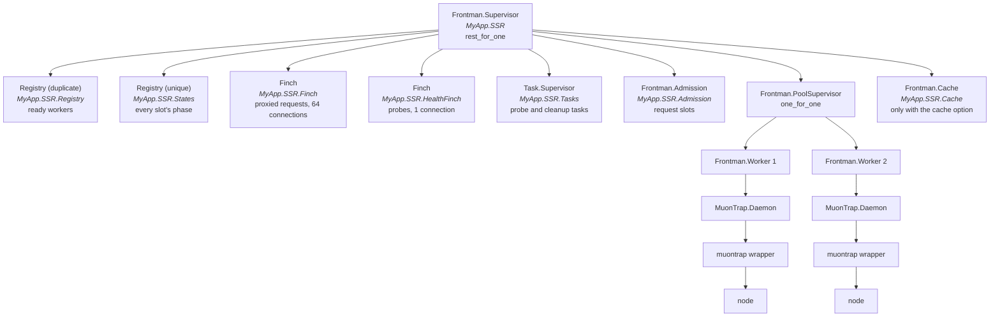
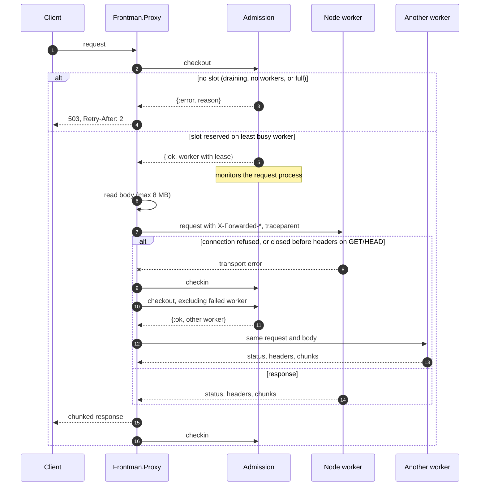
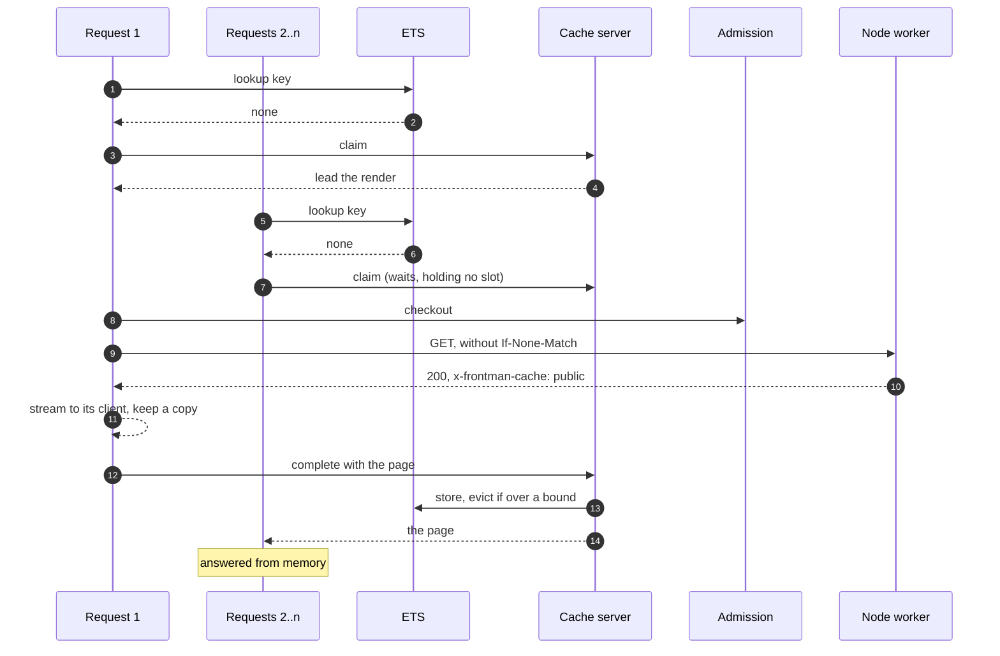
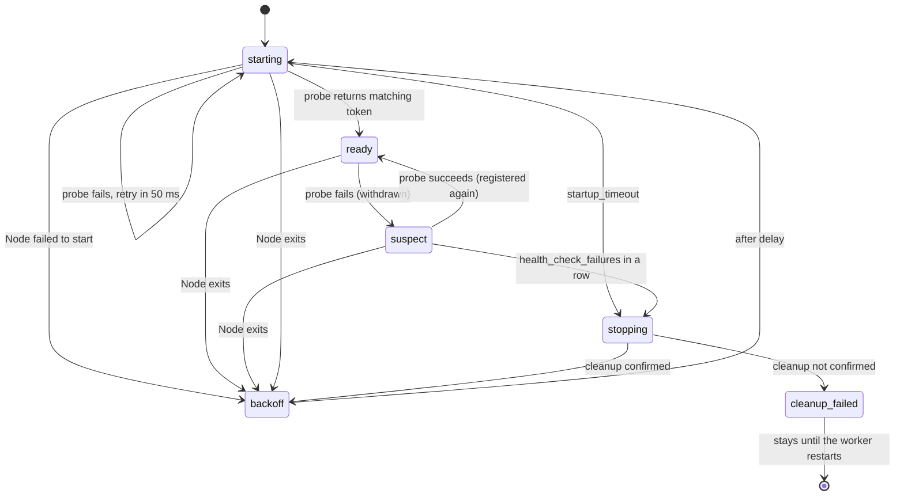
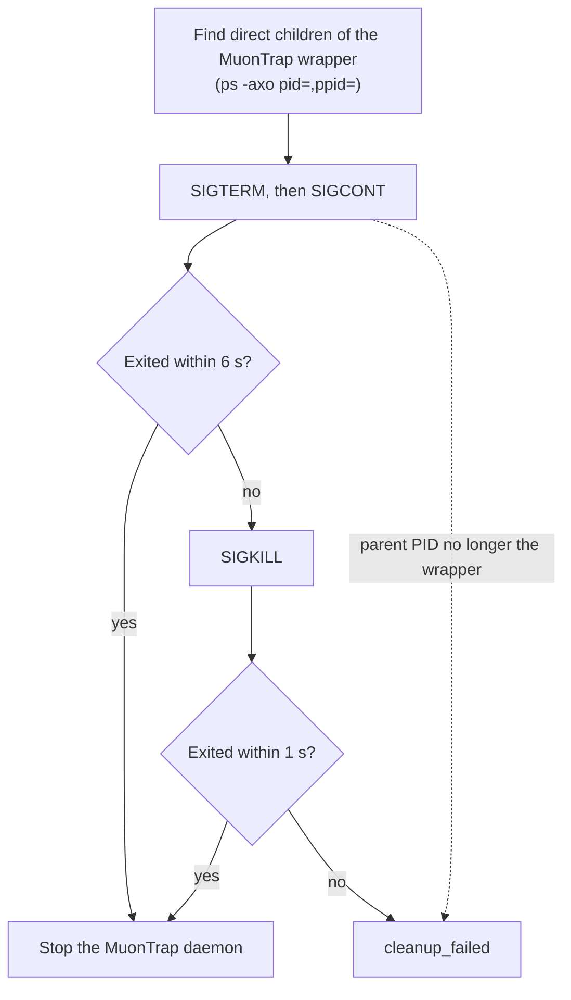
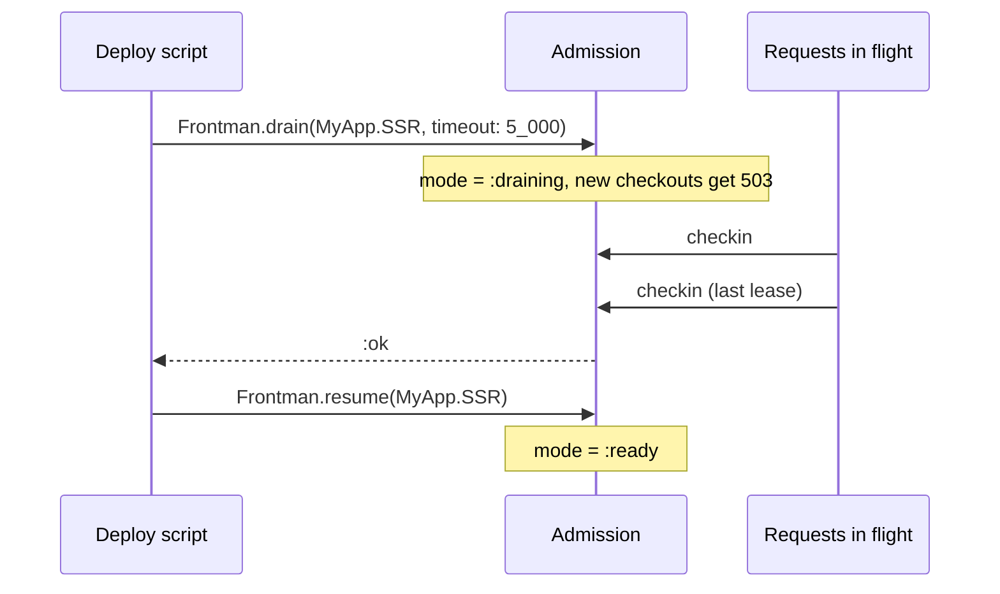

# How it works

Frontman has three parts. A supervisor per pool owns the Node processes. An admission server
hands out request slots. A Plug streams requests to whichever worker got the slot.

## Supervision tree

Each call to `Frontman.start_link/1` builds one of these trees. The pool `name` prefixes every
process name, so two pools never share state.

The top supervisor is `rest_for_one`, and the workers come last. If a registry, Finch pool,
task supervisor or the admission server crashes, everything after it restarts, including the
workers. That keeps workers from holding references to processes that no longer exist.

The page cache, when configured, comes after the workers. If it crashes, it restarts empty
and Node keeps running. On shutdown it stops first, and requests waiting on it go to the workers.

Workers sit in their own `one_for_one` supervisor, so one worker crashing doesn't touch the
others. That supervisor has a shared restart budget of five times the configured worker count
within ten seconds; one worker can consume the whole budget. In practice a worker
rarely crashes: it handles Node exits, failed starts and failed probes itself, with backoff, as
described below. OTP restarts are for bugs in the worker, not for Node misbehaving.

## Request path

### Admission

`Frontman.Admission` is one GenServer per pool. It holds a map of leases: one per request in
flight, each tied to a worker. HTTP bodies never pass through it.

On checkout it:

1. Lists ready workers from the registry, minus any the caller excluded.
2. Drops workers already at `max_concurrency`.
3. Picks the one with the fewest leases, breaking ties at random.
4. Monitors the calling process and records the lease.

If the pool is draining, has no ready workers, or every worker is full, checkout fails at once.
There's no queue. A request that would wait for capacity gets a 503 instead, and the client can
retry after two seconds.

A lease ends when the proxy checks in, or when the request process exits and the monitor fires.
Checking in twice is harmless. A checkout carries a one-second deadline, so a backed-up mailbox
can't grant a slot to a request that has already given up.

The proxy reserves the slot before it reads the request body. Under overload, Phoenix rejects
requests without buffering their bodies. The cost is that a slow upload holds a slot while it
uploads.

### Proxying

The proxy forwards the method, path, query, body and most headers. It removes hop-by-hop
headers and `content-length`, appends the client address to `x-forwarded-for`, and sets
`x-forwarded-proto` and `x-forwarded-host` if they aren't already present. It injects the
current OpenTelemetry context, and wraps each attempt in a `frontend.proxy` client span.

Responses come back through `Finch.stream_while/5`. The proxy sends status and headers as soon
as Node does, minus hop-by-hop headers and `content-length`. It keeps every `Set-Cookie`, and
keeps the `x-request-id` that `Plug.RequestId` set. Bodies stream chunk by chunk. If the client
disconnects, the proxy stops reading from Node, which cancels the upstream request. `HEAD`,
`204`, `304` and `1xx` responses are sent without a body.

A failed attempt retries on another worker only when that's safe:

| Error | Retries | Why |
| --- | --- | --- |
| Connection refused | Any method | Node never got the request |
| Connection closed before response headers | `GET` and `HEAD` only | Node may have run a write |
| Anything else, or after headers were sent | Never | The client already has part of a response |

Each retry excludes the workers that already failed, so a request tries each worker at most
once.

## Page cache

The cache is one GenServer per pool and three ETS tables: pages, pages known to be uncacheable,
and the pool's cache settings. Request processes read the tables directly, so a hit never
calls the server. The server makes every change to what's stored, and decides who renders a
missing page.

If the response can't be stored, request 1 tells the server as soon as it knows, usually at the
headers. The waiters then render their own pages through admission, as uncached requests do.
The key is also remembered as uncacheable, so later misses on it go straight to Node instead of
waiting.

A leader that crashes is caught by a monitor. A waiter gives up after 15 seconds, and a render
older than that stops collecting waiters, so a stuck render can't hold a page hostage.

### Freshness

Each page records when it was stored. Within `max-age` it's a hit. Within
`stale-while-revalidate` after that, it's served stale and the request asks the server for a
refresh. The server starts one task per page under the pool's task supervisor. The task checks
out a slot like any request, renders without the visitor's cookies, and stores the result. A
refresh that gets a 5xx, a 503 from admission or a broken response leaves the stale copy in
place and allows another try a second later. A refresh that returns a page that can't be stored
removes it.

### Invalidation

`Frontman.invalidate/2` runs in the server. It removes the matching pages and increments a
counter. Every render records the counter, and a reference unique to the running cache, when it
starts. The server ignores a finished render whose counter or reference is out of date. So a
render that read old data before an invalidation can't store it afterwards, even if the cache
restarted in between.

### Admission and drain

Only requests that go to Node take a slot: a leader, a refresh, a waiter that falls back, and
every request for an uncacheable page. Hits and waiters don't. A full pool therefore still
answers hits, and waiters can't exceed `max_concurrency`, because the ones that fall back
check out a slot like any other request.

During a drain, hits are served and misses get 503s. A leader that already holds a slot finishes,
and the drain waits for it as usual.

## Worker lifecycle

Each `Frontman.Worker` owns one Node process at a time, across restarts. It keeps its own
backoff history, so a broken build retries slower and slower instead of exhausting OTP's
restart limit and taking the application down.

### Starting

On each start the worker picks a free loopback port and a new random token, then starts Node
through `MuonTrap.Daemon` with `HOST=127.0.0.1`, `PORT`, `FRONTEND_WORKER_TOKEN` and
`SERVER_SHUTDOWN_TIMEOUT=4`. It probes `GET /__frontend/ready` every 50 ms until the response
carries the same token and a positive integer `pid`.

The token matters because the port is only reserved for a moment. The worker opens a socket to
get a free port, closes it, then starts Node. Another process could take the port in between.
The token means a stranger on that port can never register as a worker.

The `pid` matters because MuonTrap's OS PID is the wrapper's, not Node's. `Frontman.workers/1`
reports Node's real PID so you can signal or inspect it.

### Health checks

Once ready, the worker probes again `health_check_interval` after each probe finishes. Probes
run in a task with a hard deadline of `health_check_timeout`, on a separate one-connection
Finch pool. They don't use request slots, and they never block the worker process.

The first failed probe moves the worker to `suspect` and removes it from the ready registry,
so it gets no new requests. Requests already in flight carry on. A successful probe puts it
back. After `health_check_failures` failures in a row, the worker stops Node and replaces it.

The probe only hits Node. It doesn't touch Phoenix or the database, so a slow backend doesn't
make Frontman restart healthy Node processes.

### Backoff

Every unplanned stop goes through backoff. The delay ceiling starts at `restart_backoff_min`
and doubles per attempt up to `restart_backoff_max`. The actual delay is random, between half
the ceiling and the ceiling, so workers that failed together don't restart together.

A successful start doesn't reset the attempt count. The worker has to stay ready for
`restart_backoff_reset_after` first. A process that boots and crashes ten seconds later keeps
backing off.

### Stopping Node

Closing the MuonTrap port isn't proof that Node exited. A stopped (SIGSTOP) process, for
example, can leave the wrapper waiting. So cleanup is explicit:

Before every signal, cleanup checks that the process's parent is still the wrapper. If it can't
confirm that, it stops rather than risk signalling a reused PID. A worker in `cleanup_failed`
starts no new Node process, because it can't prove the old one has gone. It emits a telemetry
event so you can alert on it.

Cleanup only covers Node itself. It doesn't track Node's own child processes, and there's no
cgroup containment. If the BEAM or the wrapper is killed outright, Node can be orphaned.

## Drain

Drain flips the admission server into `:draining`. New checkouts fail, leases already granted
run to completion, and the call returns `:ok` when the last lease ends or `{:error, :timeout}`
when the deadline passes. Either way the pool stays closed until `Frontman.resume/1`.

Drain doesn't stop Node, cancel requests, or touch backend routes, assets or cached pages. A worker that
restarts during a drain comes back into a closed pool.
