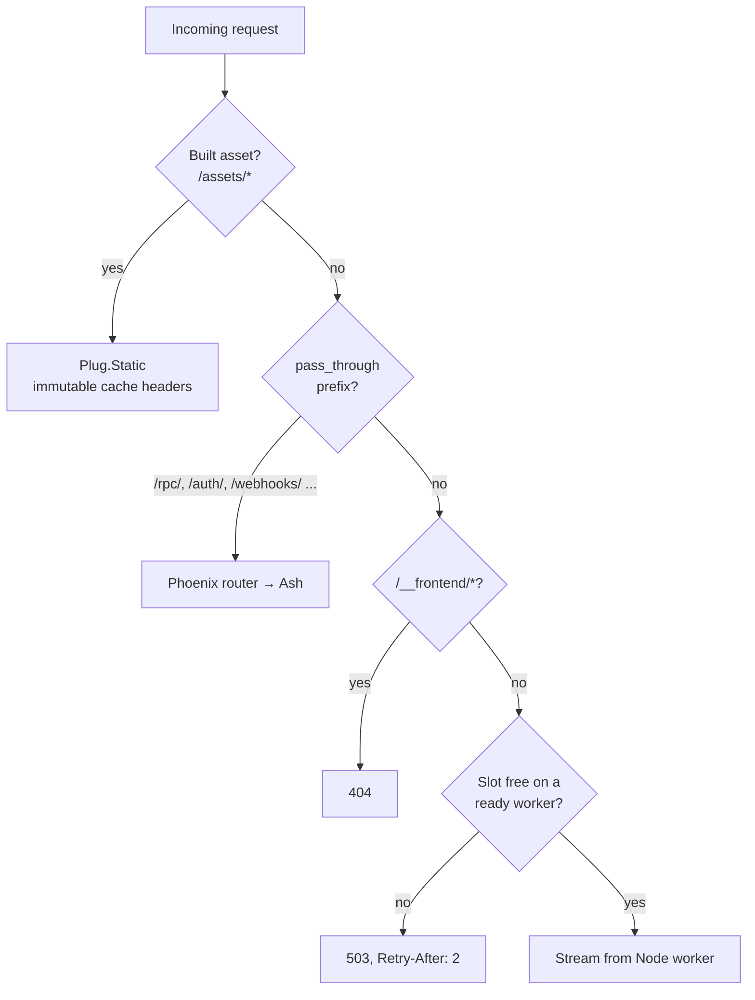
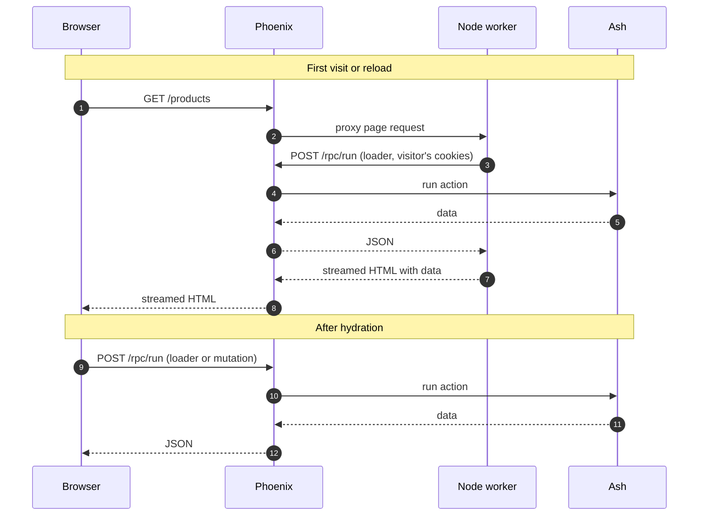

# Purpose

Frontman lets one Elixir release serve a TanStack Start frontend. Phoenix keeps the public
port, Ash keeps the data, and Node renders HTML as a supervised child of the BEAM.

## The stack it was built for

Frontman came out of an application built on:

- **Phoenix** for the endpoint, sessions, sockets, webhooks and the RPC route.
- **Ash** for the domain model, validation and authorization.
- **AshTypescript**, which generates a typed TypeScript client for Ash actions that are exposed
  through `/rpc/run`.
- **TanStack Start** for routing, React rendering, SSR and hydration.

The usual way to deploy that pair is two containers: Phoenix in one, Node in the other, and a
reverse proxy in front deciding which paths go where. Every deploy has to move both together,
and the proxy config has to match the router. The application ran both ways and ended up with
Node supervised inside the release. Frontman is that supervision, readiness and proxy code,
pulled out into a library. The application kept its routes, assets and data loading.

## Phoenix owns the request

With Frontman, the browser only ever talks to Phoenix. Phoenix decides per request whether to
answer it itself or stream it from a Node worker.

Your application chooses the `pass_through` prefixes. Frontman has no opinion about which paths
are backend paths.

## Keep Node on the full-page rendering path

TanStack Start route loaders run on the server during SSR and in the browser for client-side
navigation. The same loader can call the generated Ash RPC client in both environments.
A `createIsomorphicFn` transport selects the fetch implementation: Node uses Phoenix's loopback
address and forwards the visitor's cookies; the browser uses same-origin `/rpc/run`.

With that loader pattern, mutations made through Ash RPC, and Phoenix serving the built assets,
Node is only needed for full page renders. Frontman doesn't enforce this pattern. Start server
functions and server routes still use Node when called.

In this integration, navigation data and Ash RPC mutations go straight from the browser to
`/rpc/run`. Those requests and Phoenix-hosted assets remain available while Node workers restart.
Full page renders still need a ready Node worker.

In one deployed test, switching loaders from Start server functions to direct Ash RPC and serving
hashed assets through Phoenix reduced combined Node and BEAM CPU by about 58% over 80 client
navigations. Navigation time was unchanged. This is one application measurement, not a general
performance guarantee. [Measurement details](measurements.md) records the environment and results.

[Setup](setup.md#6-load-data-through-ash-rpc) shows the transport that makes this work.

## Why not Inertia or LiveReact SSR?

Phoenix already has ways to render JavaScript on the server. Inertia's Phoenix adapter and
LiveReact both keep a pool of Node processes that take a render job and return HTML, and
Phoenix sends the response.

TanStack Start doesn't fit that model. It's a full HTTP server: it handles streaming, its own
assets, redirects, headers and server functions as well as SSR. Frontman keeps Start's HTTP
contract unchanged and proxies to it. Moving the frontend back out to its own container means
changing environment variables and routing, not React components or Ash actions.

## When to use it

Frontman is a good fit when:

- You want one deployable for a Phoenix app and its TanStack Start frontend.
- Your host gives you one container or one VM, and adding a second service costs more than it
  saves.
- You already route `/rpc/run` and sessions through Phoenix, and want pages on the same origin
  without a reverse proxy splitting paths.
- You want Node restarts, health checks and drains in the same supervision tree and telemetry
  as the rest of the app.

## When not to use it

Separate containers are still the safer default for many teams. Choose them when:

- Frontend and backend deploy on different schedules or are owned by different teams.
- You need separate memory limits. Each Node worker is a full process. In one local test, an app
  container used about 650 MiB with 16 idle workers and about 390 MiB with one.
- You need to scale SSR independently of the API.
- You need WebSockets or trailers proxied to Node.
- You can't accept Phoenix on the page path. A Phoenix outage takes pages down with the API.

## What Frontman doesn't do

- Build TanStack Start or bundle a Node binary into your release.
- Generate the AshTypescript client.
- Serve static assets. Use `Plug.Static` before the proxy.
- Proxy to a Vite dev server. See [Setup](setup.md#8-development).
- Expose a public health endpoint. Your app combines `Frontman.workers/1` with its own checks.
- Configure an OpenTelemetry exporter. It creates spans through the API only.
